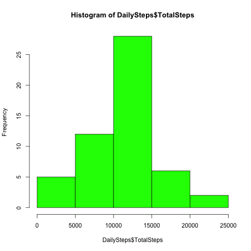

Reproducible Research - Peer Assessment 1  
========================================================

This document describes the steps and associated R code to explore and analyze personal activity monitoring device data. The data consists of two months of data from an anonymous individual collected during the months of October and November, 2012 and include the number of steps taken in 5 minute intervals each day. 

The variables included in this dataset are:

**steps**: Number of steps taking in a 5-minute interval (missing values are coded as NA)

**date**: The date on which the measurement was taken in YYYY-MM-DD format

**interval**: Identifier for the 5-minute interval in which measurement was taken

The dataset is stored in a comma-separated-value (CSV) file and there are a total of 17,568 observations in this dataset.

**Step 1: Loading and preprocessing the data**
1. Load the data into a data.frame - _ActivityData_
2. Convert 'date' column from _factor_ to _date_ class 


```r
ActivityData <- read.csv("activity.csv")
ActivityData$date <- as.Date(as.character(ActivityData$date))
```


**Step 2: Calculate mean total number of steps taken per day**  
_Missing values are ignored for this part of the analysis_

2(a). Make a histogram of the total number of steps taken each day

```r
DailySteps <- aggregate(ActivityData$steps, by=list(ActivityData$date),FUN=sum)
colnames(DailySteps) <- c("Date", "TotalSteps")
hist(DailySteps$TotalSteps, col = "green")
```

 

2(b). Calculate and report the mean and median total number of steps taken per day  
    
    

```r
mean(DailySteps$TotalSteps, na.rm=TRUE)
median(DailySteps$TotalSteps, na.rm=TRUE)
```
Mean of total steps taken per day is **10766.19**  
Median of total steps taken per day is **10765**  


**Step 3: Explore the average daily activity pattern**  

3(a). Make a time series plot (i.e. type = "l") of the 5-minute interval (x-axis) and the average number of steps taken, averaged across all days (y-axis)

```r
IntervalActivity <- aggregate(ActivityData$steps, by=list(ActivityData$interval),FUN=mean, na.rm=TRUE)
colnames(IntervalActivity) <- c("Interval","MeanSteps")
with(IntervalActivity, plot(Interval, MeanSteps, type="l"))
```

 

3(b). Identify the 5-minute interval, on average across all the days in the dataset, which contains the maximum number of steps


```r
MaxStepsIndex <- which.max(IntervalActivity$MeanSteps)
MaxStepRow <- IntervalActivity[MaxStepsIndex,]
MaxStepRow$Interval
```
5-minute interval, which on average contains the the maximum number of steps is **835**.


**Step 4: Impute missing values and analyze the data again**  

4(a). Calculate and report the total number of missing values in the dataset (i.e. the total number of rows with NAs)


```r
MissingValues <- !complete.cases(ActivityData)
sum(MissingValues)
```
Total number of rows with missing values (NAs) = **2304**

4(b,c). Strategy for filling in all of the missing values in the dataset - The mean for the 5-minute interval has been used, for each missing value of _steps_ variable corresponding to that 5-minute interval. A new dataset _ActivityDataComplete_ will be created, that is equal to the original dataset but with the missing data filled in.


```r
ActivityDataComplete <- ActivityData
for (i in 1:nrow(ActivityDataComplete)) {
    if(is.na(ActivityDataComplete[i,1])) {
        ActivityDataComplete[i,1] <- IntervalActivity[match(ActivityDataComplete[i,3], IntervalActivity$Interval),2]
    }
}
```

4(d). Make a histogram of the total number of steps taken each day and Calculate and report the mean and median total number of steps taken per day. 


```r
DailyStepsNew <- aggregate(ActivityDataComplete$steps, by=list(ActivityDataComplete$date),FUN=sum)
colnames(DailyStepsNew) <- c("Date", "TotalSteps")
hist(DailyStepsNew$TotalSteps, col = "green")
```

 


```r
mean(DailyStepsNew$TotalSteps, na.rm=TRUE)
median(DailyStepsNew$TotalSteps, na.rm=TRUE)
```
Mean of total steps taken per day is **10766.19**  
Median of total steps taken per day is **10766**  

**Do these values differ from the estimates from the first part of the assignment?**  
**Answer:** These values do not differ from the first par of the assignment.


**What is the impact of imputing missing data on the estimates of the total daily number of steps?**  
**Answer:** There is no significant impact on mean and median of the total daily number of steps by filling the missing values through the selected strategy  


**Step 5: Analyze the differences in activity patterns between weekdays and weekends**

5(a). Create a new factor variable in the dataset with two levels – “weekday” and “weekend” indicating whether a given date is a weekday or weekend day.


```r
ActivityDataComplete$WeekDayFlag <- factor(weekdays(ActivityDataComplete$date) %in% c("Saturday","Sunday"))
levels(ActivityDataComplete$WeekDayFlag)[levels(ActivityDataComplete$WeekDayFlag)=="TRUE"] <- "weekend"
levels(ActivityDataComplete$WeekDayFlag)[levels(ActivityDataComplete$WeekDayFlag)=="FALSE"] <- "weekday"
```

5(b). Make a panel plot containing a time series plot (i.e. type = "l") of the 5-minute interval (x-axis) and the average number of steps taken, averaged across all weekday days or weekend days (y-axis). 

_Note: 'lattice' library has been used to draw the plot_


```r
IntervalActivityNew <- aggregate(ActivityDataComplete$steps, by=list(ActivityDataComplete$interval, ActivityDataComplete$WeekDayFlag),FUN=mean, na.rm=TRUE)
colnames(IntervalActivityNew) <- c("Interval","WeekDayFlag","MeanSteps")

library(lattice)
xyplot(MeanSteps ~ Interval | WeekDayFlag, data = IntervalActivityNew, layout = c(1, 2), type="l", ylab="Number of steps", xlab="Interval")
```

 

